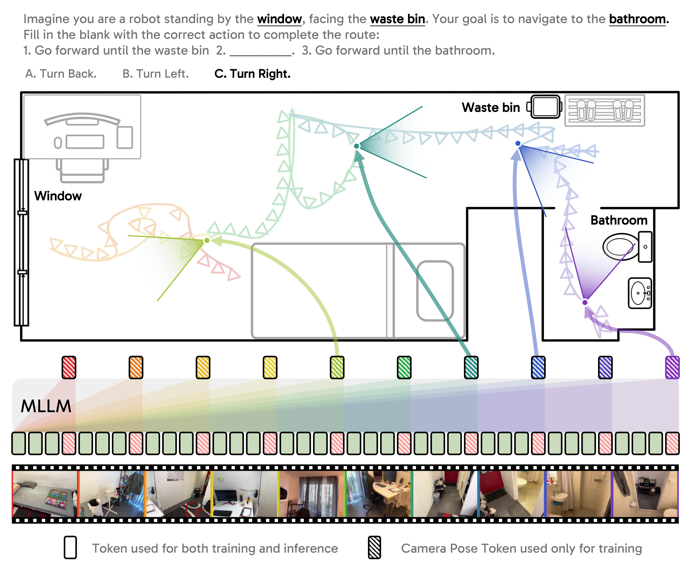
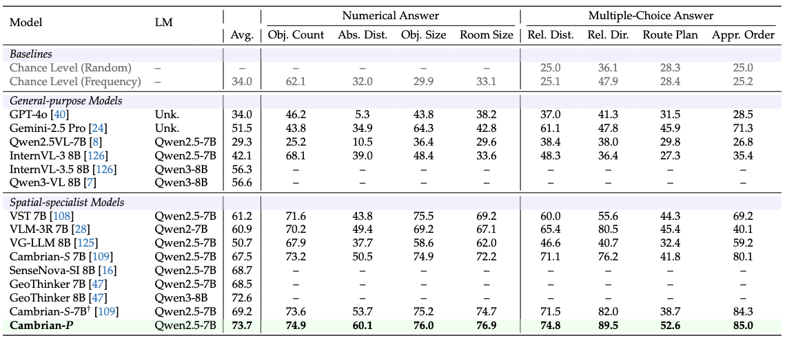
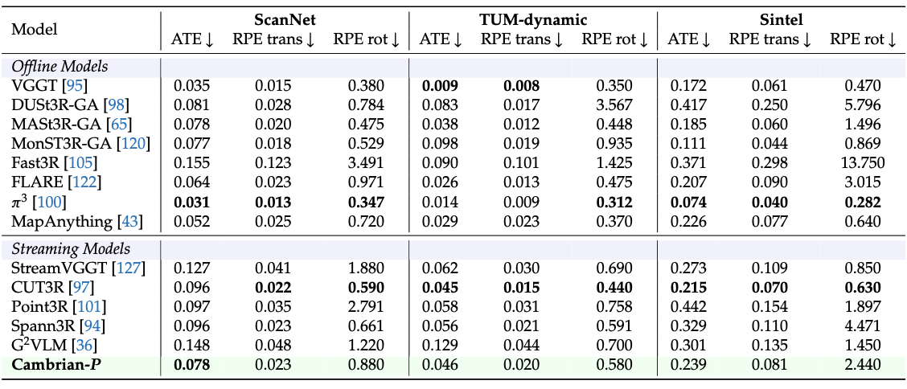

<div align="center">

# *Cambrian-P*:<br> Pose-Grounded Video Understanding

<p>
    
</p>

<a href="https://arxiv.org/abs/2605.22819" target="_blank">
    
</a>
<a href="https://cambrian-mllm.github.io/cambrian-p/" target="_blank">
    
</a>
<a href="https://huggingface.co/collections/nyu-visionx/cambrian-p-models" target="_blank">
    
</a>
<a href="https://huggingface.co/datasets/nyu-visionx/Cambrian-P-Data" target="_blank">
    
</a>

<div style="font-family: charter;">
    <a href="https://jihanyang.github.io/" target="_blank">Jihan Yang</a><sup>1*</sup>,
    <a href="https://www.zifanzhao.com" target="_blank">Zifan Zhao</a><sup>1*</sup>,
    <a href="https://xichenpan.com/" target="_blank">Xichen Pan</a><sup>1</sup>,
    <a href="https://github.com/vealocia" target="_blank">Shusheng Yang</a><sup>1</sup>,
    <a href="https://junyi42.github.io/" target="_blank">Junyi Zhang</a><sup>2</sup>,
    <br>
    <a href="https://bingykang.github.io/" target="_blank">Bingyi Kang</a><sup>1</sup>,
    <a href="https://howardhsu.github.io/" target="_blank">Hu Xu</a><sup>3</sup>,
    <a href="https://www.sainingxie.com/" target="_blank">Saining Xie</a><sup>1</sup>
</div>

<div style="font-family: charter;">
    <sup>1</sup>New York University&nbsp;&nbsp;
    <sup>2</sup>UC Berkeley&nbsp;&nbsp;
    <sup>3</sup>Meta FAIR
</div>

<div style="font-family: charter;">
*Equal Contribution — JY led the project, JY and ZZ contributed equally.
</div>

</div>

## Release

- 🔥 **Cambrian-P** is out — [paper](https://arxiv.org/abs/2605.22819), [model checkpoints](https://huggingface.co/collections/nyu-visionx/cambrian-p-models), the annotated pose [Cambrian-P-Data](https://huggingface.co/datasets/nyu-visionx/Cambrian-P-Data), and full training/eval code are all released.

## Contents

- [*Cambrian-P*: Pose-Grounded Video Understanding](#cambrian-p-pose-grounded-video-understanding)
  - [Release](#release)
  - [Contents](#contents)
  - [Cambrian-P Weights](#cambrian-p-weights)
    - [VSI-Bench Performance](#vsi-bench-performance)
    - [Pose Estimation Performance](#pose-estimation-performance)
    - [Model Card](#model-card)
  - [Train](#train)
    - [Environment Preparation](#environment-preparation)
    - [Data Preparation](#data-preparation)
    - [Training Scripts](#training-scripts)
  - [Evaluation](#evaluation)
  - [Citation](#citation)
  - [Related Projects](#related-projects)
  - [License](#license)

## Cambrian-P Weights

Cambrian-P is a pose-grounded video MLLM. Built on top of the [Cambrian-S](https://github.com/cambrian-mllm/cambrian-s) architecture (SigLIP2-SO400m vision encoder + Qwen2.5 LLM + MLP projector), it introduces one learnable camera token per frame (via two learnable query embeddings — one for the first frame, one for the rest) and a lightweight pose head adapted from [VGGT](https://github.com/facebookresearch/vggt). A single forward pass answers spatial video questions *and* regresses per-frame camera translation, rotation, and field-of-view — enabling both **improved spatial video QA** and **streaming camera pose estimation**.

### VSI-Bench Performance

Spatial video understanding on [VSI-Bench](https://vision-x-nyu.github.io/thinking-space/). Cambrian-P-7B (Qwen2.5-7B + SigLIP2-SO400m) achieves 73.7 average accuracy, the best among 7B-scale spatial-specialist models, with a **+4.5%** gain over Cambrian-S-7B (its no-pose counterpart) and particularly strong results on Relative Direction, Object Count, Route Plan, and Appearance Order.

<p align="center">
    
</p>

### Pose Estimation Performance

Streaming camera pose estimation on ScanNet, TUM-dynamic, and Sintel, following the [MonST3R](https://github.com/Junyi42/monst3r) protocol. For ScanNet and TUM-dynamic we sample the first 90 frames at temporal stride 3; for Sintel we exclude static / near-straight sequences. All metrics use Sim(3) alignment.

Cambrian-P achieves the lowest ATE on ScanNet among all streaming models, competitive with offline pipelines — without a DINOv2 encoder or a bidirectional transformer.

<p align="center">
    
</p>

Metric definitions follow [evo](https://github.com/MichaelGrupp/evo): ATE = absolute trajectory error RMSE (meters), RPE-t / RPE-r = per-frame relative pose error RMSE (meters / degrees).

### Model Card

We release **five Cambrian-P-7B variants**. All share the same backbone (Qwen2.5-7B + SigLIP2-SO400m + per-frame camera tokens + VGGT-style pose head) and finetune from Cambrian-S-7B stage 3.

| Model | Training Data | Hugging Face |
|---|---|---|
| **Cambrian-P-7B** | VSI | [nyu-visionx/Cambrian-P-7B](https://huggingface.co/nyu-visionx/Cambrian-P-7B) |
| Cambrian-P-7B-32f | VSI | [nyu-visionx/Cambrian-P-7B-32f](https://huggingface.co/nyu-visionx/Cambrian-P-7B-32f) |
| Cambrian-P-7B-Mix-MA | VSI + MapAnything | [nyu-visionx/Cambrian-P-7B-Mix-MA](https://huggingface.co/nyu-visionx/Cambrian-P-7B-Mix-MA) |
| Cambrian-P-7B-Mix-3R | VSI + partial VLM-3R | [nyu-visionx/Cambrian-P-7B-Mix-3R](https://huggingface.co/nyu-visionx/Cambrian-P-7B-Mix-3R) |
| Cambrian-P-7B-Mix-CamS | VSI + Cambrian-S | [nyu-visionx/Cambrian-P-7B-Mix-CamS](https://huggingface.co/nyu-visionx/Cambrian-P-7B-Mix-CamS) |


## Train

### Environment Preparation

```bash
git clone https://github.com/cambrian-mllm/cambrian-p.git
conda create -n cambrianp python=3.11 cmake=3.14.0
conda activate cambrianp

cd cambrian-p/vggt && pip install -e .
pip install hydra-core tensorboard iopath wcmatch fvcore

cd .. && pip install --upgrade pip && pip install -e ".[train]"

# PyTorch 2.4.1 + CUDA 12.1 + flash-attn 2.8.3
pip install torch==2.4.1+cu121 torchvision==0.19.1+cu121 torchaudio==2.4.1+cu121 \
    --index-url https://download.pytorch.org/whl/cu121
pip install --no-deps https://github.com/Dao-AILab/flash-attention/releases/download/v2.8.3/flash_attn-2.8.3+cu12torch2.4cxx11abiFALSE-cp311-cp311-linux_x86_64.whl
pip install accelerate==0.29.3 easydict matplotlib roma evo imageio OpenEXR
```

See [`doc/env_install.md`](doc/env_install.md) for the detailed version.

### Data Preparation

Cambrian-P fine-tunes from Cambrian-S-7B stage 3 on three required pieces:

| Piece | Source | Size | Used for |
|---|---|---|---|
| 1. VSI-590K (VQA + scene geometry) | [`nyu-visionx/vsi-590k`](https://huggingface.co/datasets/nyu-visionx/vsi-590k) | ~236 GB | Spatial QA + scene pose supervision |
| 2. Cambrian-S 3M videos | [`nyu-visionx/Cambrian-S-3M`](https://huggingface.co/datasets/nyu-visionx/Cambrian-S-3M) | per-source | Video backbone for the pose-annotated half of training |
| 3. Cambrian-P pseudo pose annotations | [`nyu-visionx/Cambrian-P-Data`](https://huggingface.co/datasets/nyu-visionx/Cambrian-P-Data) | ~850 MiB | Dense pose supervision on the partial Cambrian-S-3M |

See [`doc/data_preparation.md`](doc/data_preparation.md) for the full recipe.


### Training Scripts

Please check [`cambrianp/scripts/`](cambrianp/scripts/)
**Training Script Sample test:** *(run [§Data Preparation Quickstart](doc/data_preparation.md#quickstart) first)*

```bash
conda activate cambrianp
export WANDB_API_KEY=<your-key>         
export DATA_DIR=/path/to/vsi-590k                        
export VIPE_CAMBRIANS_DATA_ROOT=/path/to/cambrian_s_3m  
export VIPE_CAMBRIANS_RESULTS_ROOT=/path/to/cambrian_p_pose  
export OUTPUT_DIR=$PWD/ckpts                            

bash cambrianp/scripts/Cambrian-P-7B.sh
```

## Evaluation

Please refer to [`doc/evaluation.md`](doc/evaluation.md).

## Citation

If you find our work useful for your research, please consider citing:

```bibtex
@article{yang2026cambrianp,
  title   = {Cambrian-P: Pose-Grounded Video Understanding},
  author  = {Yang, Jihan and Zhao, Zifan and Pan, Xichen and Yang, Shusheng and Zhang, Junyi and Kang, Bingyi and Xu, Hu and Xie, Saining},
  journal = {arXiv preprint arXiv:2605.22819},
  year    = {2026},
}
```

## License

See [`LICENSE`](LICENSE).

## Related Projects

- [Cambrian-1](https://github.com/cambrian-mllm/cambrian) — *Cambrian-1: A Fully Open, Vision-Centric Exploration of Multimodal LLMs*
- [Thinking in Space](https://github.com/vision-x-nyu/thinking-space) — *Thinking in Space: How Multimodal Large Language Models See, Remember and Recall Spaces* (introduces VSI-Bench)
- [Cambrian-S](https://github.com/cambrian-mllm/cambrian-s) — spatial supersensing in video (shared training-data recipe)
- [VGGT](https://github.com/facebookresearch/vggt) — reconstruction backbone
- [DUSt3R](https://github.com/naver/dust3r) / [MonST3R](https://github.com/Junyi42/monst3r) — evaluation protocol
- [CUT3R](https://github.com/CUT3R/CUT3R), [StreamVGGT](https://github.com/wzzheng/StreamVGGT), [MapAnything](https://github.com/facebookresearch/map-anything) — evaluation baselines
